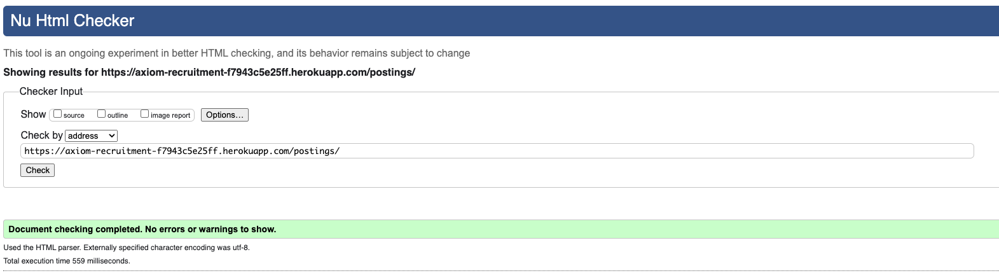
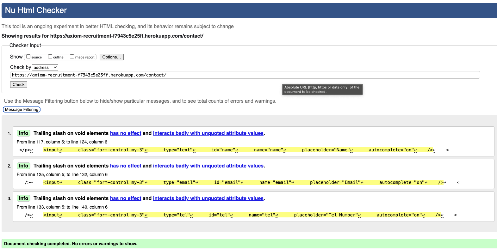
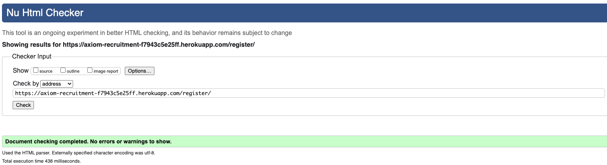
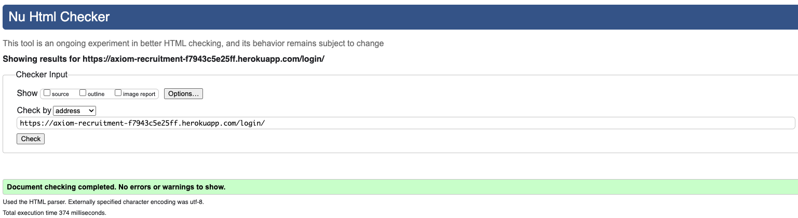
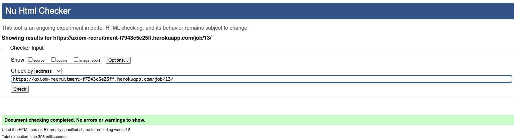
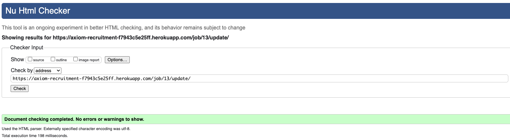

# Testing

Return to [README.md](README.md) file

## Code Validation

### HTML

I have used the recommended [HTML W3C Validator](https://validator.w3.org) to validate all of my HTML files.

| Page | W3C URL | Before Screenshot | After Screenshot | Notes |
| --- | --- | --- | --- | --- |
| Home | [W3C](https://validator.w3.org/nu/?doc=https%3A%2F%2Faxiom-recruitment-f7943c5e25ff.herokuapp.com%2F) |  | --- | --- |
| Jobs | [W3C](https://validator.w3.org/nu/?doc=https%3A%2F%2Faxiom-recruitment-f7943c5e25ff.herokuapp.com%2Fpostings%2F) |  | --- | No errors |
| Services | [W3C](https://validator.w3.org/nu/?doc=https%3A%2F%2Faxiom-recruitment-f7943c5e25ff.herokuapp.com%2Fservices%2F) |  | --- | No errors |
| Contact | [W3C](https://validator.w3.org/nu/?doc=https%3A%2F%2Faxiom-recruitment-f7943c5e25ff.herokuapp.com%2Fcontact%2F) |  | --- | --- |
| Register | [W3C](https://validator.w3.org/nu/?doc=https%3A%2F%2Faxiom-recruitment-f7943c5e25ff.herokuapp.com%2Fregister%2F) |  | --- | No errors |
| Login | [W3C](https://validator.w3.org/nu/?doc=https%3A%2F%2Faxiom-recruitment-f7943c5e25ff.herokuapp.com%2Flogin%2F) |  | --- | No errors |
| Logout | [W3C](https://validator.w3.org/nu/?doc=https%3A%2F%2Faxiom-recruitment-f7943c5e25ff.herokuapp.com%2Flogout%2F) |  | --- | No errors |
| Profile | [W3C](https://validator.w3.org/nu/?doc=https%3A%2F%2Faxiom-recruitment-f7943c5e25ff.herokuapp.com%2Fprofile%2F) |  | --- | No errors |
| Job Detail | [W3C](https://validator.w3.org/nu/?doc=https%3A%2F%2Faxiom-recruitment-f7943c5e25ff.herokuapp.com%2Fjob%2F13%2F) |  | --- | No errors |
| Job Update | [W3C](https://validator.w3.org/nu/?doc=https%3A%2F%2Faxiom-recruitment-f7943c5e25ff.herokuapp.com%2Fjob%2F13%2Fupdate%2F) |  | --- | No errors |
| Job Delete | [W3C](https://validator.w3.org/nu/?doc=https%3A%2F%2Faxiom-recruitment-f7943c5e25ff.herokuapp.com%2Fjob%2F13%2Fdelete%2F) |  | --- | No errors |

### CSS